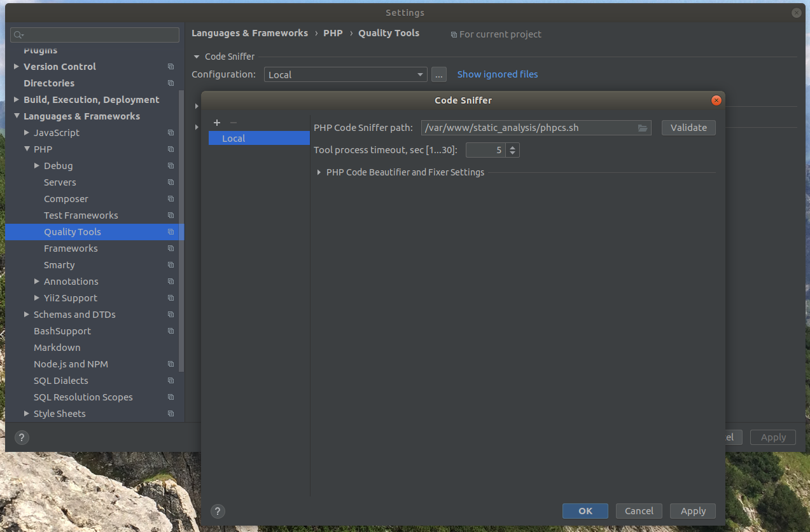

# PHP static analyzer
##Описание:
Данный контейнер создан для запуска статических анализаторов кода (не зависит от локально установленной версии php)
##Установка
Запустить команду `make install`
##Настройка PhpStorm
1. В шторме открыть настройки`Quality Tools`->`Code Sniffer` и перейти в `Configuration`
2. В `PHP Code Sniffer path` указать абсолютный путь к `phpcs.sh` файлу

3. Аналогичным образом насторить `Mess Detector` и `PHP CS Fixer` (указать `phpmd.sh` и `php-cs-fixer.sh` соответственно)
